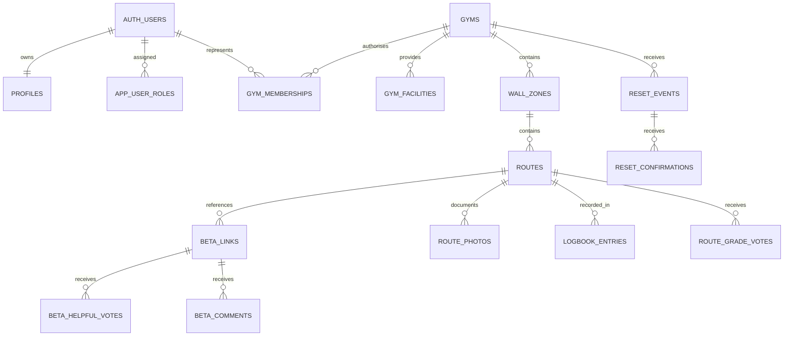

# BlocLens Data Architecture

## Purpose and stage boundary

This document defines the PostgreSQL, authorisation and iPhone transport contract for the BlocLens MVP. Stage 6A is design and local source implementation only: the app still launches entirely offline with the existing Mock repositories. There is no Supabase SDK, remote project, network client, credential, remote migration or external API connection.

BlocLens remains a climbing utility first. Logbook records are private by default, beta is public external-link metadata only, and wall navigation uses named lists rather than two-dimensional geometry.

## Data sources and entry paths

Gym and climbing information may eventually enter through four controlled paths:

- curated public commercial-gym information;
- future Google Places enrichment, with stored attribution requirements but no API connection in this stage;
- signed-in community contributions and corrections;
- verified gym representatives operating only within authorised gyms.

Official gym changes use the same audited database surface as community data. Service-role access remains exclusive to trusted server and separate administrator-web infrastructure.

## Entity relationships

Primary identifiers are UUIDs and mutable primary entities use `created_at` and `updated_at` as `timestamptz`. Content with historical value is hidden, archived, deleted softly or redirected to a canonical route rather than physically discarded.

## Core entities

### Authentication, profiles and authority

Supabase `auth.users` remains the authentication source and is never altered. `profiles.id` references it one-to-one. Username is the only required first-use profile field and is case-insensitively unique. Height, arm span, regular grade and favourite gym are optional. The 16+ self-declaration records only its confirmation time, never a full birth date.

Sensitive authority does not live in client-editable profile fields:

- `app_user_roles` holds administrator and moderator assignments;
- `gym_memberships` grants a verified representative one gym scope;
- `gym_claims` records domain-email or manual verification review;
- stable `SECURITY DEFINER` checks read these tables with an empty `search_path`.

The client cannot set roles, `is_trusted_contributor`, `trusted_contributor_awarded_at` or `helpful_received_count`.

### Gyms and named wall zones

`gyms` stores map coordinates, Australian address fields, optional operating/contact data, verification, source and future Google attribution metadata. Latitude and longitude have geographic checks and bounding-box indexes. Deletion is soft.

`gym_facilities` uses a controlled facility enum. `wall_zones` stores a gym, name, description, wall type, order, availability and reset date. A live zone name is unique within its gym. There are no coordinates, polygons, hotspots or indoor-navigation geometry in wall-zone data.

### Climbing routes and resets

`routes` requires a gym, matching wall zone, and at least a colour or label. V Grades are integers from `-1` (`VB`) through `17`; null represents `Unknown`. Current, temporarily hidden and archived lifecycle states are distinct. Estimated archive dates carry an explicit estimate Boolean and are never treated as certain removal evidence.

`gym_reset_patterns`, `reset_events` and `reset_confirmations` separate official, community-confirmed and estimated reset data. Official reset events take effect immediately. A non-official event requires three distinct confirmation rows. Confirmation automation updates the event state but does not indiscriminately archive routes.

### Route photos

`route_photos` stores a future image Storage path, dimensions, attribution and moderation metadata. It never stores image bytes. Official images can later be preferred; otherwise the maintained Helpful count supports cover selection. The schema does not contain a video entity.

### External beta links and comments

`beta_links` contains HTTPS public URLs, a normalised URL and hash, platform, original-author attribution, original-post URL, fixed tags, contributor measurements, Helpful count, health, embed capability, official attribution and moderation state. A trigger validates and normalises both URLs. Broken or source-removed links remain historical rows.

Beta URLs and metadata are login-gated: the `anon` role is revoked from `beta_links` and `beta_ranking_inputs`, so a guest can see a route's beta count (via `visible_beta_count_for_route(uuid)`) but never a URL, author, tag, platform or health value. The SwiftUI Reveal gate is a user-experience layer, not the security boundary; the database revoke is.

There is no uploaded media, download, cache, proxy, transcode, video size, resolution, frame-rate or video Storage field. Client ranking consumes height, arm span, Helpful and stable ID metadata; it does not require profile measurements.

`beta_comments` are flat, public comments capped at 200 characters. Official provenance is recorded explicitly. Soft deletion and moderation hiding preserve auditability.

### Private Logbook

`logbook_entries` is owner-only under RLS. Status is `want_to_try`, `projecting`, `sent` or `flash`. It records climbing date, optional attempts, optional private note and optional predicted grade. A per-user client idempotency UUID prevents duplicate offline synchronisation. Local queued/synced state remains a client concern rather than a false server truth.

No public profile, view or RPC exposes a private note. Ordinary moderation work does not grant access to Logbook rows. Archived routes retain their Logbook history.

Account deletion uses the `auth.users` relationship as the boundary: the profile, private Logbook, personal preferences, follows, blocks, votes and Helpful rows cascade away with the account. Public contributions that retain community history use `ON DELETE SET NULL` for the submitting account and become unattributed rather than exposing a deleted identity. This is the Stage 6A technical strategy; final export timing and any legally required retention must be confirmed before production deployment.

### Relationships and feedback

`favourite_gyms`, `user_follows`, `user_blocks` and `notification_preferences` are scoped to their owner. Block relationships are private; the blocked user cannot discover who blocked them. Inserting a block removes follow relationships in both directions. `notification_outbox` is server-only and contains no APNs token in this stage.

`app_feedback` stores a message plus optional future screenshot path and non-sensitive app context. Current-page data must never include a private note. No video attachment is supported.

## Row Level Security matrix

Every client-facing business table has RLS enabled and an explicit policy.

| Data area | Guest | Signed-in user | Verified gym | Admin or moderator |
|---|---|---|---|---|
| Public gyms, zones, routes, resets | Read visible data | Read; contribute where permitted | Manage authorised gym scope | Review and manage through secure authority |
| Public beta metadata and comments | Read count only; no URL or metadata | Read visible data; submit own data, Helpful and comments | May submit official content for own gym | Moderate through audited actions |
| Community grade | Read only threshold-safe aggregate | Vote only after an attempted Logbook state | Cannot edit community votes | Review abuse; no arbitrary aggregate editing |
| Profile | Read approved public columns | Read/update own editable profile fields | Same, plus scoped official provenance | Role changes through protected operations |
| Logbook | No access | Owner-only CRUD | No access to another owner | No routine access and no private public surface |
| Follows, favourites, preferences | No access | Owner/participant scope | Same personal scope | No public disclosure |
| Blocks and reports | No access | Own submissions only | Cannot read reporter identities | Secure review scope only |
| Roles, memberships, moderation audit | No access | No authority mutation | Read own scope only | Secure role checks and audited changes |

Table grants narrow columns before RLS. This matters for `profiles`, `beta_links`, `route_photos` and grade votes: even a row-level owner policy cannot be used to mutate protected counters, moderation state, roles or trust fields.

## Public and private boundaries

Security-invoker views preserve underlying RLS:

- `public_profiles` exposes username, avatar, optional body dimensions, regular grade and Trusted Contributor status only;
- `gym_summaries`, `wall_zone_summaries` and `route_summaries` expose public discovery projections including only a sanitised beta count (never a beta URL or metadata);
- `beta_ranking_inputs` is authenticated-only and `reset_summaries` is public;
- `moderation_queue` and `gym_official_scope` remain role-restricted through source-table policies and grants.

`get_my_profile()` returns the authenticated user's complete application profile through an owner-only RPC. Community-grade and hard/soft RPCs expose only threshold-safe aggregate output. Reporter identities, block membership, private notes, auth provider details and internal penalties never enter public projections.

## Official gym and administrator boundaries

A verified gym representative may update opening/contact data, facilities, named wall zones, reset events, routes and official attribution only for a gym with an active membership. A representative cannot alter community V Grade votes, Helpful votes, another person's Logbook, platform roles or another gym.

Administrators and moderators are resolved through protected role rows, not JWT input supplied by the client. The administrator web portal is a separate product surface. Service-role operations, secrets and broad moderation queries belong there, never in the iPhone app.

## Community V Grade

`route_grade_votes` has one current row per user and route. Its insert/update policy calls `has_attempted_route`: `projecting`, `sent` and `flash` qualify; `want_to_try` does not. The client cannot bypass that rule by changing aggregate data.

`community_grade_summary(route_id)` returns vote count and eligibility for all public routes, but returns the median only at three or more distinct votes. Median uses ordered V Grade integers, never an arithmetic mean. `gym_hard_soft_summary(gym_id)` compares gym and community medians within V0–V2, V3–V5 and V6+ bands and returns `Not enough community data` below the evidence threshold.

## Helpful and Trusted Contributor

Helpful vote tables use a `(target_id, user_id)` primary key, preventing duplicates. A trigger rejects self-votes. Aggregate counts are recomputed from rows under a row lock rather than incremented from client values. When valid Helpful received across a user's beta links reaches 67, the database sets Trusted Contributor and its award timestamp. Recalculation can reduce the count later, but never removes an already awarded status.

## Route lifecycle, reset evidence and duplicate merge

Routes preserve history through lifecycle, `archived_at`, reason and optional canonical-route reference. Three distinct valid removal reports plus the applicable product date condition can archive a route. An official gym or administrator decision remains auditable and does not erase related content.

`merge_routes(source, target, note)` is admin-only, locks both routes and migrates beta links, grade votes, comments through beta ownership, and Logbook rows transactionally. Duplicate user/route votes and Logbook rows are resolved deterministically. The source becomes archived and points to the canonical target; a moderation action records the merge.

## Corrections, reports and automatic hiding

Unique partial indexes prevent the same account accumulating an open correction, removal or content report more than once. Three distinct open route corrections temporarily hide a route for review. Ordinary content categories hide after three distinct reports. Severe categories—nudity, harassment, violence and minor privacy—hide after one report. All automatic actions write `moderation_actions`, and authorised reviewers can restore content without destroying history.

Reporter identity stays in restricted tables. Target-validation triggers ensure a report points to an existing row of the declared type.

## Index strategy and common queries

| Client or admin query | Supporting index |
|---|---|
| Map bounds, State and suburb | latitude/longitude, State/suburb indexes |
| Gym name search | `pg_trgm` GIN index on lowercased name (`gyms_name_trgm_idx`) |
| Gym suburb search | `pg_trgm` GIN index on lowercased suburb (`gyms_suburb_trgm_idx`) |
| Wall-zone name search | `pg_trgm` GIN index on lowercased name (`wall_zones_name_trgm_idx`) |
| Route colour and label search | `pg_trgm` GIN indexes on lowercased colour/label (`routes_colour_trgm_idx`, `routes_label_trgm_idx`) |
| Wall zones for a gym | gym/order and live-name indexes |
| Current or archived routes | gym/lifecycle, zone/lifecycle and archive indexes |
| Route colour, label and grade | lowercased colour/label and grade indexes |
| Recent resets | gym/date and zone/date indexes |
| Beta and comments by parent | route/date and beta/date indexes |
| Owner Logbook filters | user/status/date and idempotency indexes |
| Grade votes and report thresholds | route/user and target/status indexes |
| Official scope and preferences | membership gym/user and owner primary keys |

Indexes are limited to MVP access paths. PostGIS is intentionally absent; numeric latitude and longitude are enough for the first map queries. The `pg_trgm` extension is installed in the `extensions` schema; trigram indexes target the fields the client search contract actually matches (gym name, gym suburb, wall-zone name, route colour and route label). Username has no trigram index because the MVP search never targets users.

## Swift DTO mapping boundary

Transport records live in `BlocLens/Persistence/Remote` and use `Codable`, `Sendable`, explicit snake-case coding keys, Foundation UUIDs and ISO 8601 timestamps. `RemoteJSONCoding` accepts PostgreSQL timestamps with or without fractional seconds and emits fractional ISO 8601 UTC strings.

DTOs map into existing typed Domain IDs, `VGrade`, lifecycle, privacy and beta enums. Unsupported enum values, malformed UUIDs, unsafe URLs and inconsistent threshold data produce `RemoteMappingError`; none force-unwrap or crash a view. Public beta mapping accepts HTTPS only. Server Logbook rows map as `synced` and always `privateByDefault`.

The initial DTO set is `GymRecord`, `GymFacilityRecord`, `WallZoneRecord`, `RouteRecord`, `ResetRecord`, `BetaLinkRecord`, `CommunityGradeRecord`, `LogbookEntryRecord` and `UserProfileRecord`. They are transport types, not SwiftUI state. `RemoteSeedIdentifiers` records the deterministic correspondence between current readable Mock IDs and development seed UUIDs.

## Offline and synchronisation boundary

The existing actor-based Mock repositories remain the only runtime implementation. A future remote repository will own SDK calls, authentication tokens, retries, caching and idempotent upload. Feature views continue consuming the current repository protocols and Domain models.

Offline Logbook writes keep their local queued state and client idempotency key. The database stores the idempotency key but does not pretend to know whether a device queue is pending. Conflict resolution, durable local cache and retry scheduling remain next-stage repository concerns.

## Storage plan and explicit media exclusion

No Storage bucket is created in Stage 6A. Future image-only planning may include `avatars`, `gym-photos`, `route-photos` and `feedback-attachments`. Database rows store paths and image metadata only.

There is explicitly no video database table, video bucket, direct video upload, file download, cache, proxy, compression or transcoding path. Beta remains an HTTPS link to the original public platform with author and source attribution.

## Next-stage remote integration sequence

1. Create a user-owned Supabase project and record its non-secret project URL and anon key in a local, ignored configuration—not in source control.
2. Review and run migrations against a disposable local Supabase environment first; run `schema_contract.sql` and concurrency tests.
3. Review Supabase/PostgreSQL version compatibility for security-invoker views and the local-only auth seed.
4. Apply migrations to a non-production remote development project through an approved deployment workflow.
5. Add the official Supabase Swift package only in the explicitly authorised integration stage.
6. Implement remote repositories behind the existing protocols and preserve Mock implementations for previews and tests.
7. Add authenticated integration tests for guest, owner, gym official, moderator and administrator RLS cases.
8. Add safe local configuration, key rotation and separate server-side service-role handling.

## Known risks and incomplete validation

- Migrations 0001–0012 are deployed to the linked Cloud development project and also apply cleanly to a reset disposable local Supabase PostgreSQL 17 database. The deterministic development seed loads locally, the pgTAP contract suite passes 63 tests, and local `supabase db lint` reports no errors.
- Migration 0012 removes default client execution rights from trigger-only functions, makes all exposed views read-only, restricts management views to authenticated users, moves `citext` out of `public`, and fixes the beta URL normalisation function search path. Supabase Security Advisor continues to report the deliberately exposed `SECURITY DEFINER` RPCs; those RPCs are limited to public summaries, current-user checks, or functions with internal administrator role enforcement.
- Direct development inserts into Supabase-managed `auth.users` are version-sensitive and local-only.
- Account deletion/anonymisation, exported Logbook delivery and production retention require a confirmed legal/product policy before implementation.
- External URL allow-listing, redirect safety and link health checking need a trusted server boundary.
- The separate administrator portal and secure server operations are not implemented.
- Storage policies are not defined because no bucket is created in this stage.
