# BlocLens Core User Flows

## Flow conventions

- Each flow is intentionally short and vertical so it remains readable in product and engineering review.
- A solid arrow represents a user or system transition.
- Decision nodes describe PRD-defined conditions, not implementation details.
- Public beta always means an attributed external public link. No video file is transferred to BlocLens.

## Flow 1 — First launch and guest map entry

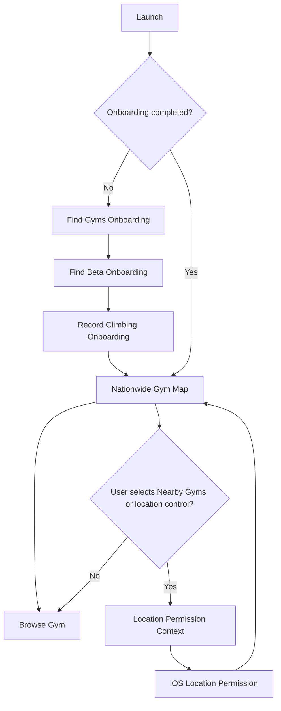

Onboarding is three pages and skippable. The guest arrives at the map without an upfront login wall. Location is never requested during launch or onboarding; it is requested only after the user explicitly selects **Nearby Gyms** or the map location control.

## Flow 2 — Find a target route within 60 seconds

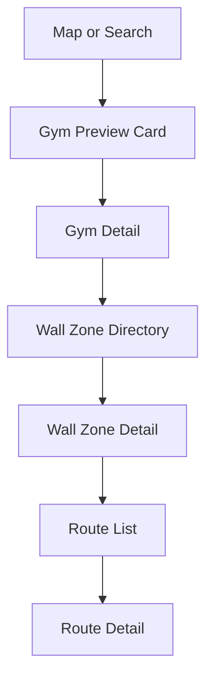

The path prioritises the PRD success threshold of 60 seconds or less from gym or zone entry to the target route. The wall-zone directory is a structured list of names, location descriptions, wall attributes, reset information and counts. There is no 2D wall map, floor plan or clickable hotspot step.

## Flow 3 — Reveal beta with authentication gate

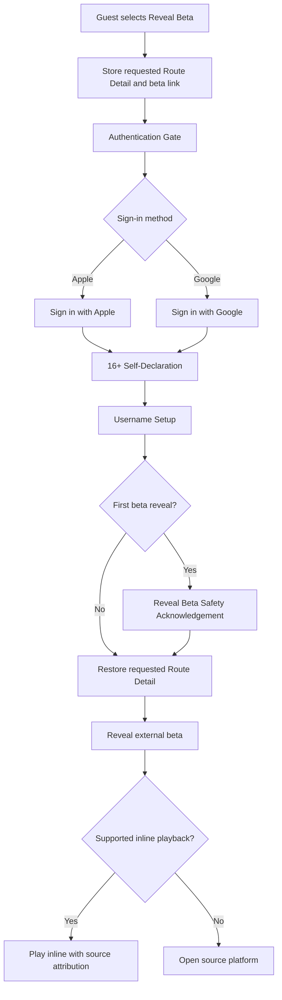

Authentication is contextual. After successful authentication, age declaration and username setup, navigation restores the exact route and beta intent rather than sending the user to Home. The source platform, original author and original post remain visible.

## Flow 4 — Quick Logbook save

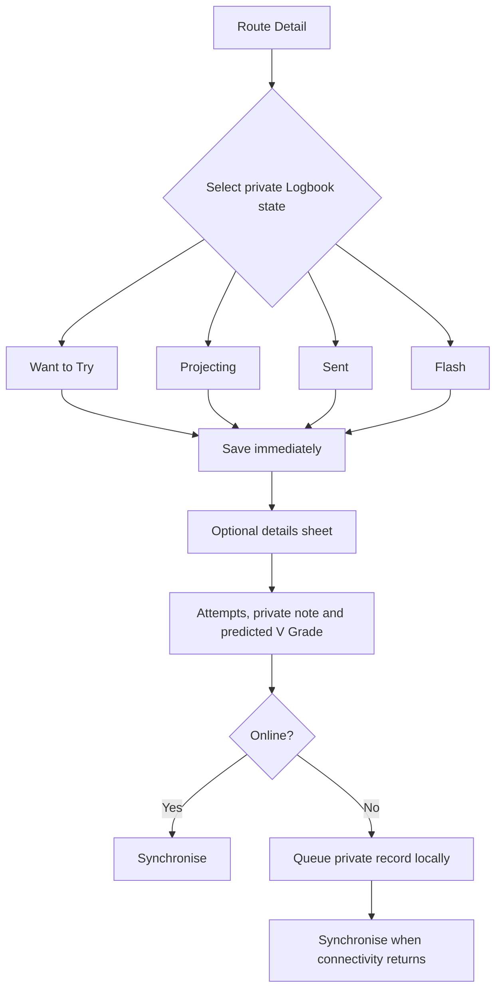

The selected state saves before optional details are requested. **Flash** is always available as a manual choice. Every record is private by default. A predicted V Grade stored in the private record is not a public community vote unless the user performs a separate explicit contribution action.

## Flow 5 — Add a new route

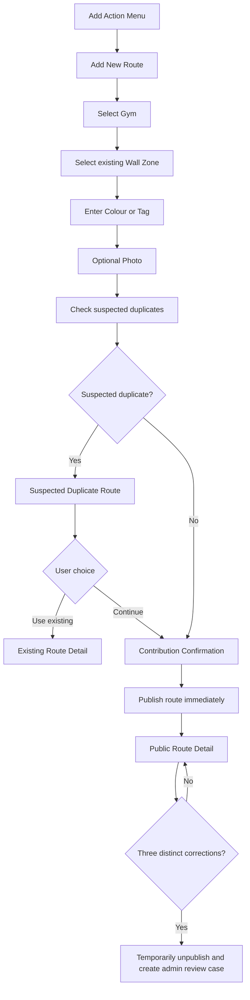

Gym, an existing named wall zone, and colour or tag are the only required creation fields. A photo is optional. Duplicate detection informs rather than blocks: the user can select a likely existing route or explicitly continue.

## Flow 6 — Publish an external beta link

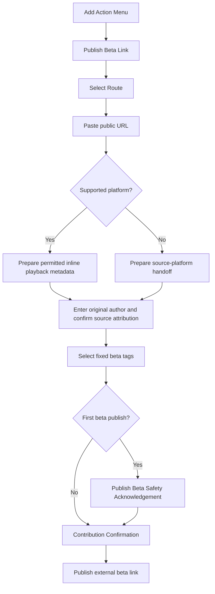

Fixed tags are **Full Solution**, **Crux**, **Static**, **Dynamic**, **Short-person Beta**, and **Tall/Long-reach Beta**. Unsupported platforms open at the source. Publication stores link metadata, attribution, tags and moderation state only; no video file transfer to BlocLens occurs.

## Flow 7 — Route photo and hold marking

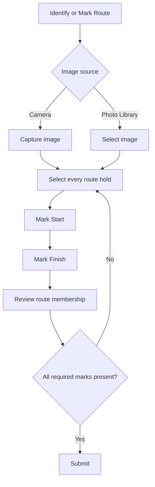

Hold marking records route membership only. Start and Finish are separately identified. The MVP does not require move order and does not perform automatic AI route recognition.

## Flow 8 — Community V Grade

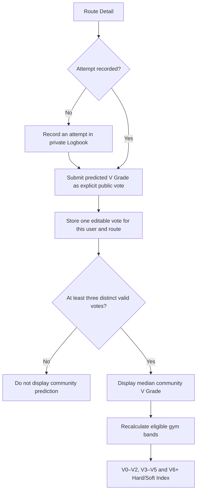

The public community result is the median, never the arithmetic mean. Official grades and community predictions remain visually distinct. Only routes meeting the three-vote threshold participate in gym hard/soft calculations.

## Flow 9 — Reset and archive lifecycle

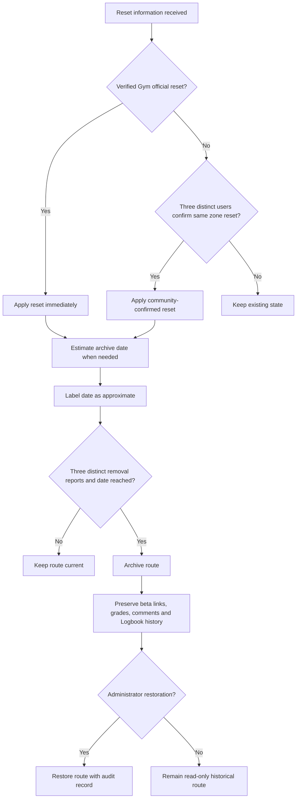

Official reset data has priority. Estimated dates are always labelled as estimates. Archive does not erase route history or the user's private Logbook references.

## Flow 10 — Reporting and moderation

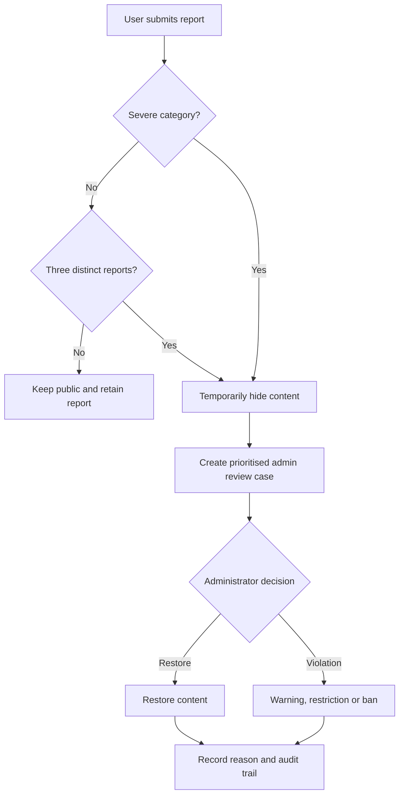

Nudity, harassment, violence or child-privacy reports use the severe one-report temporary-hide rule. Other beta and comment reports require three distinct accounts. Severe cases may skip earlier enforcement steps, but every decision records a reason and audit trail.

## Flow 11 — Voluntary contribution prompt

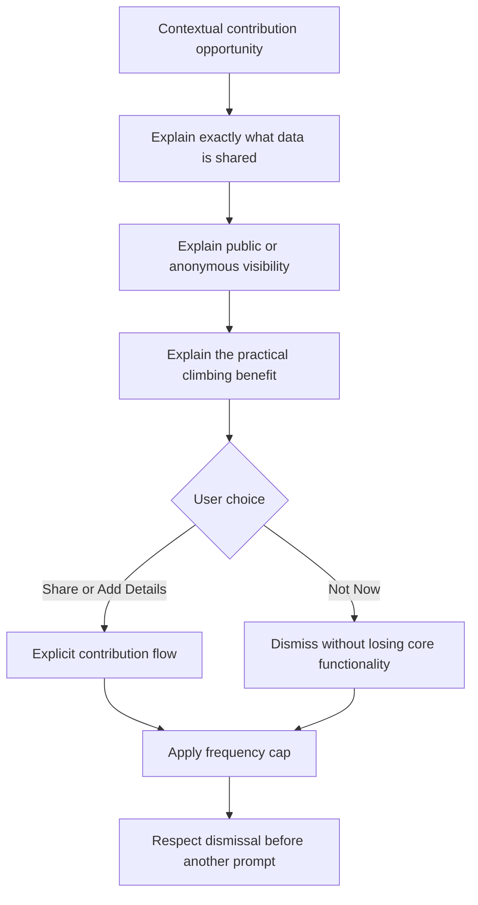

Prompts may appear for empty wall zones, missing route details, post-climb opportunities, reset confirmation, broken beta links or optional profile fields. They never use guilt, urgency or preselected consent. They never convert private Logbook data into public data.

## Flow 12 — Account deletion and Logbook export

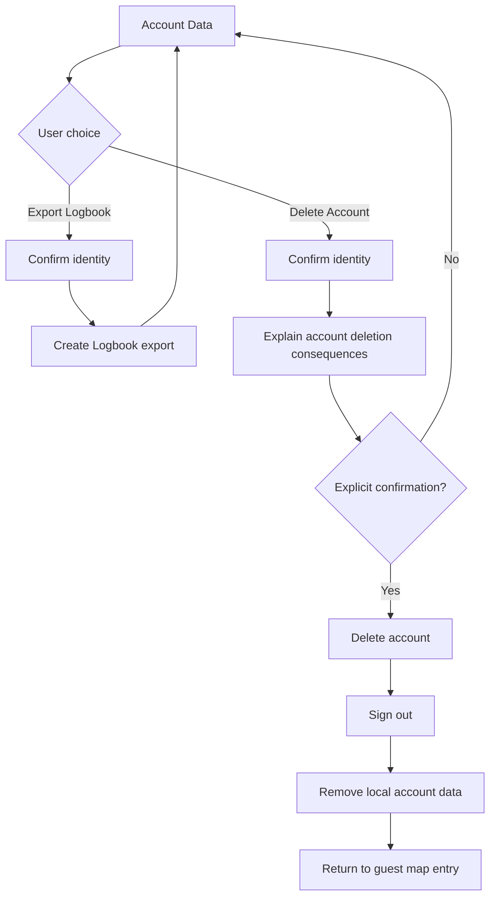

Export and deletion are separate controls. The deletion explanation must remain limited to confirmed product consequences. This specification does not invent legal retention periods or exceptions that are absent from the PRD.
